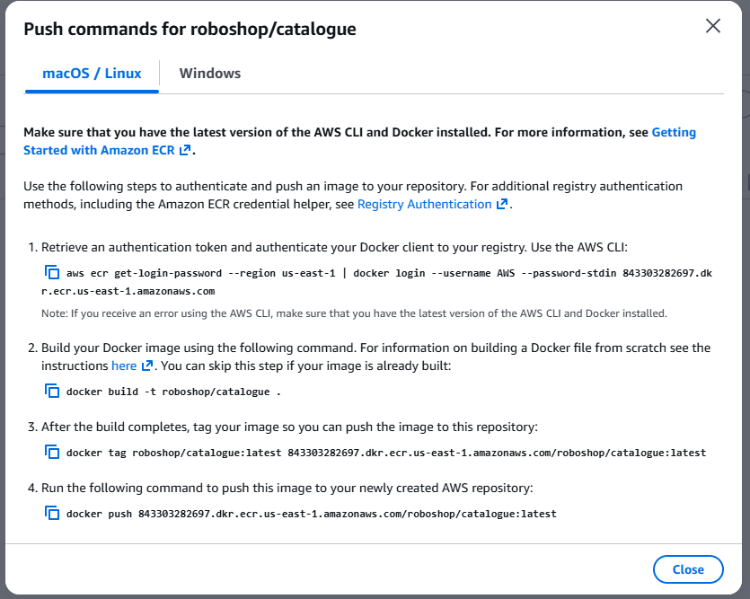

## In this repo, we will have all the Jenkins repos(code and deployment pipelines) and INFRA pipeline to deploy the Roboshop

   https://www.jenkins.io/doc/book/pipeline/jenkinsfile/   path to know the Jenkinsfile syntax and we can develop our Jenkinsfile according to our requirment.

#### Plugins to be installed

    Stage View   >>> Pipeline Stage View Plugin.
    AnsiColor    >>> Adds ANSI coloring to the Console Output
    Blue Ocean   >>> This plugin shows the output in a neat and clean way in all the stages step by step
    Pipeline Utility Steps >>> key reasons why this plugin is utilized is File and Archive Operations, Version Management, 
    Workspace Manipulation and General Utility
    AWS Credentials  >>> Allows storing Amazon IAM credentials within the Jenkins Credentials API. Store Amazon IAM access keys 
    (AWSAccessKeyId and AWSSecretKey) within the Jenkins Credentials API. Also support IAM Roles and IAM MFA Token.
    Basically, if you have this plugin, we can talk to AWS via Jenkins and perform the necessary activities.
    Pipeline: AWS Steps  >>> This plugins adds Jenkins pipeline steps to interact with the AWS API.
    SonarQube Scanner >>> This will enable the options for sonarqube in Jenkins

## Installations on Master and Node

   As our build is taking place on our agent-node we should install the nodeJS on it.

   sudo dnf module disable nodejs -y
   sudo dnf module enable nodejs:20 -y
   sudo dnf module enable nodejs:20 -y
   sudo dnf install nodejs -y

## Webhook Enabiling

   in GitHub >> settings >> Webhook >> Payload URL (Payload URL is http://jenkins.njanapati.site:8080/github-webhook/)
   Disable the SSH Verification And Add Webhook

   In Jenkins Master  >>> Configure >> Triggers >>  Enable GitHub hook trigger for GITScm polling and Save & Apply

## Docker Image Creation in Jenkinsfile

	aws ecr get-login-password --region us-east-1 | docker login --username AWS --password-stdin 843303282697.dkr.ecr.us-east-1.amazonaws.com

	docker build -t roboshop/catalogue .
	
	docker tag roboshop/catalogue:latest 843303282697.dkr.ecr.us-east-1.amazonaws.com/roboshop/catalogue:latest
	
	docker push 843303282697.dkr.ecr.us-east-1.amazonaws.com/roboshop/catalogue:latest

   Below image is from AWS console which has commands to build and push athe Image to ECR  

    