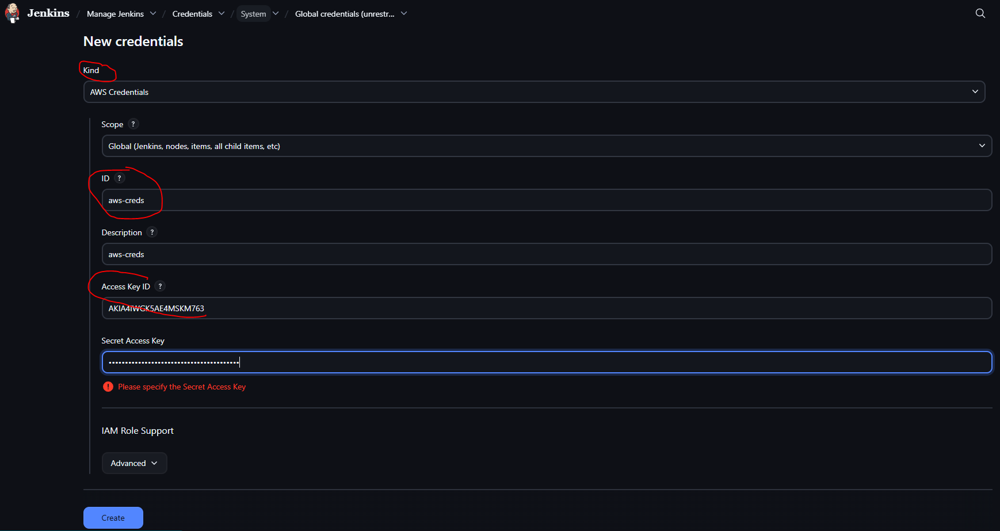
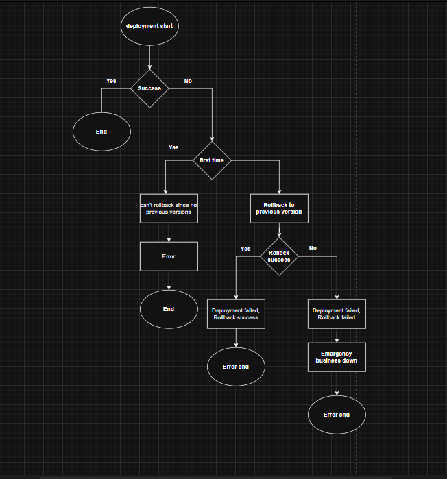

## In this repo, we will have all the Jenkins repos(code and deployment pipelines) and INFRA pipeline to deploy the Roboshop

   https://www.jenkins.io/doc/book/pipeline/jenkinsfile/   path to know the Jenkinsfile syntax and we can develop our Jenkinsfile according to our requirment.

## Plugins to be installed

    Stage View   >>> Pipeline Stage View Plugin.

    AnsiColor    >>> Adds ANSI coloring to the Console Output

    Blue Ocean   >>> This plugin shows the output in a neat and clean way in all the stages step by step

    Pipeline Utility Steps >>> key reasons why this plugin is utilized is File and Archive Operations, Version Management, 
    Workspace Manipulation and General Utility
    
    AWS Credentials  >>> Allows storing Amazon IAM credentials within the Jenkins Credentials API. Store Amazon IAM access keys 
    (AWSAccessKeyId and AWSSecretKey) within the Jenkins Credentials API. Also support IAM Roles and IAM MFA Token.
    Basically, if you have this plugin, we can talk to AWS via Jenkins and perform the necessary activities(we have to give our Access ID and Secret in the Jenkins )

    AWS Steps  >>> This plugins adds Jenkins pipeline steps to interact with the AWS API.

    SonarQube Scanner >>> This will enable the options for sonarqube in Jenkins

    rebuild >> this plugin provides an option to rebild directly, ratherthan doing a regular build

## Installations on Master and Node

   As our build is taking place on our agent-node we should install the nodeJS on it.

   sudo dnf module disable nodejs -y
   sudo dnf module enable nodejs:20 -y
   sudo dnf install nodejs -y

## Webhook Enabiling

   In GitHub >> settings >> Webhook >> Payload URL (Payload URL is http://jenkins.njanapati.site:8080/github-webhook/)
   Disable the SSH Verification And Add Webhook

   In Jenkins Master  >>> Configure >> Triggers >>  Enable GitHub hook trigger for GITScm polling and Save & Apply

## Commands to install Docker on Jenkins Agent

    sudo dnf -y install dnf-plugins-core

    sudo dnf config-manager --add-repo https://download.docker.com/linux/rhel/docker-ce.repo

    sudo dnf install docker-ce docker-ce-cli containerd.io docker-buildx-plugin docker-compose-plugin

    sudo systemctl restart docker

    sudo systemctl enable --now docker

    sudo usermod -aG docker ec2-user

    Exit and re-login to the Jenkins Agent after adding ec2-user to the Docker group

## Docker Image Creation in Jenkinsfile

	aws ecr get-login-password --region us-east-1 | docker login --username AWS --password-stdin 843303282697.dkr.ecr.us-east-1.amazonaws.com

	docker build -t roboshop/catalogue .
	
	docker tag roboshop/catalogue:latest 843303282697.dkr.ecr.us-east-1.amazonaws.com/roboshop/catalogue:latest
	
	docker push 843303282697.dkr.ecr.us-east-1.amazonaws.com/roboshop/catalogue:latest

   Below image is from AWS console which has commands to build and push athe Image to ECR  

## Adding the AWS Credentials into Jenkins

   Manage Jenkins >> Credentials >> System >> Global credentials (unrestricted) >> Add Credentials  >> AWS Credentials (as we installed AWS Credentials Plugin this option will be available in the Kind of credentials)

   Below is the image for Adding AWS Credentials into Jenkins

   Make sure we have docker installed on Jenkins Agent and do not forget to exit and login back into the Jenkins agent ec2
   

## Understanding about Testing   

   Unit testing --> test case should be written by developers only and this should be done by developer

      functions are basic blocks of the programming

         login(username, password){
	
            }
            this login function will be tested by the developers or the testers in the unit testing, by giving  the random username and passwords etc...

   Functional testing  ---> test case should be written by testers or developers

      login(username, password){
	         connectSQL()
	         checkUserName()
	         checkPassword()
            }
            here, if the login function comes here, the developers or testers should write the test cases to check the complete login function as shown above

   Integration testing --> this is done by testers in SIT/UAT/QA environments

      The test cases for integration testing are written by testers. Basically here they check if the integration between the components.
      Here we have multiple componets like catalogue, cart, shipping, user etc...
      And cart is dependent on catalogue as we know, if cart is not able to call the catalogue, then the application fails. So, test this integration between the components tester write some test cases.
      Here testers use different tools like selenium, cucumber etc to run these tests and the pipeline fails it does not pass the test cases.

## Terraform Installation on Jenkins Agent - This is required when we are creating our Infra using Jenkins Pipelines

   Install yum-config-manager to manage your repositories.

    $ sudo yum install -y yum-utils

   Use yum-config-manager to add the official HashiCorp RHEL repository.

    $ sudo yum-config-manager --add-repo https://rpm.releases.hashicorp.com/RHEL/hashicorp.repo

   Install Terraform from the new repository.
   
    $ sudo yum -y install terraform

## Install Helm and Kubernetes on the Jenkins node, as we are using Helm charts to deploy the robohop services on to K8s

   Download the kubectl binary for your cluster’s Kubernetes version from Amazon S3.

   curl -O https://s3.us-west-2.amazonaws.com/amazon-eks/1.34.2/2025-11-13/bin/linux/amd64/kubectl

   chmod +x ./kubectl   >>> Apply execute permissions to the binary.

   sudo mv kubectl /usr/local/bin    >>> moving to another folder

   kubectl version --client    >>> After you install kubectl, you can verify its version.

   Steps to install helm on our worker machine

    $ curl -fsSL -o get_helm.sh https://raw.githubusercontent.com/helm/helm/main/scripts/get-helm-3
    $ chmod 700 get_helm.sh
    $ ./get_helm.sh

## Jenkins Agent(EC2) istance SG should be mapped with the EKS SG

   Manually go to EKS security groups > edit > inbound > https > no pasthe the SG of Jenkins Agent(EC2) and save it.

   Now, perform the below steps to ensure its working

   aws console on Jenkins Agent(EC2)
   provide Access-ley and secret-key
   kubectl get nodes  >> this will work if we properly added the security groups

## Complete Setup before deploying the application

   backend repo -> CI 
   backend deploy -> CD

   1. create infra
   2. EKS setup
	      allow jenkins agent sg in eks control plane
	      create namespace
	      create DB pods
		   mongodb redis mysql rabbitmq
   3. we can deploy applications

DEV --> QA --> CR --> PROD

The below image shows how we can understand the rollback script written for a deployment in deployment Jenkinsfile

